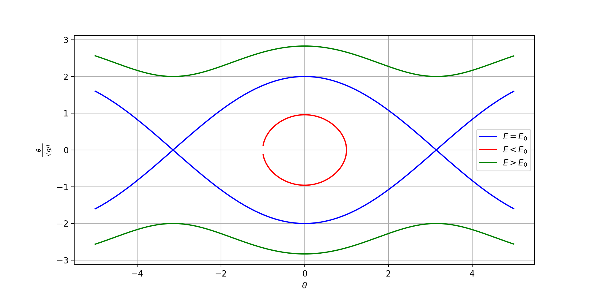
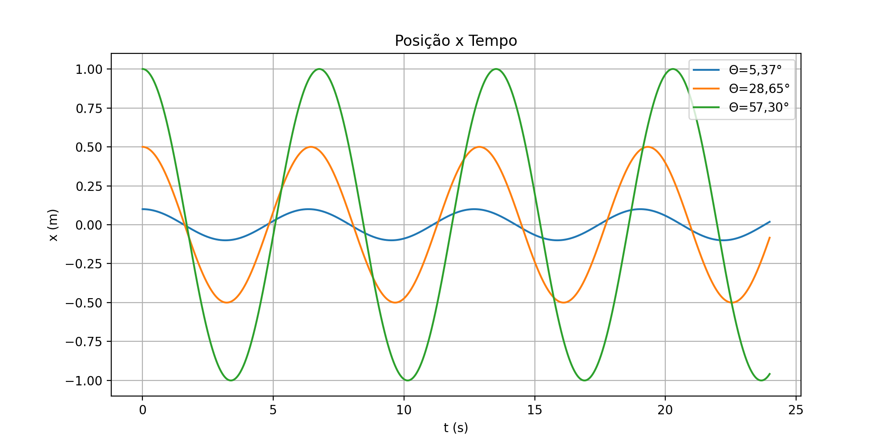
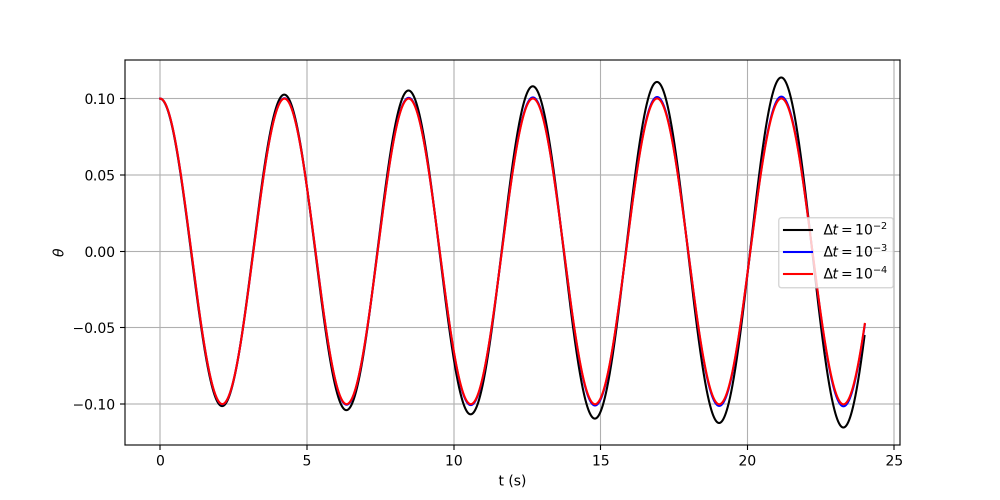
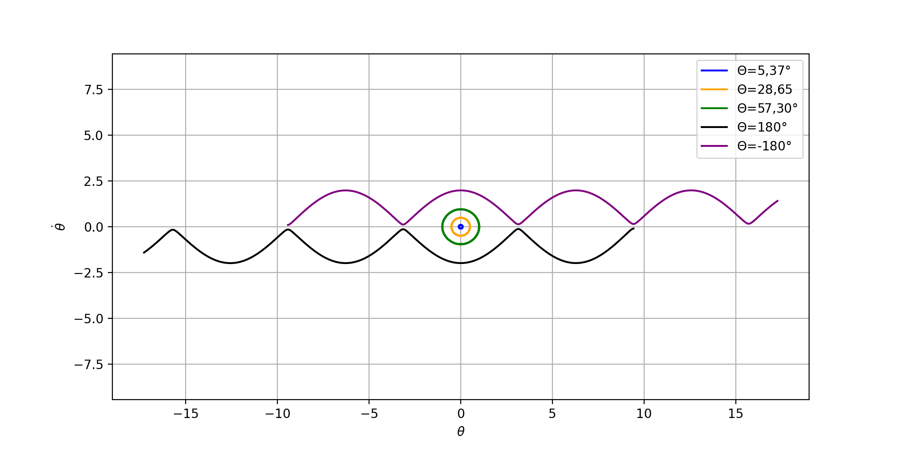

# Nonlinear Pendulum Simulation

Numerical simulation of the nonlinear pendulum using Euler's Method and the 2nd order Runge-Kutta Method.

This project compares numerical solutions and phase-space behavior for different initial conditions and time steps.

---

## Features

- Analytical phase-space diagram
- Euler method implementation
- Runge-Kutta 2nd order implementation
- Time-step comparison
- Scientific visualization using Matplotlib

--- 

## Technologies

- Python
- Numpy
- Matplotlib

---

## Project Structure

```text
NONLINEAR-PENDULUM-SIMULATION
│
├── main.py
├── requirements.txt
├── README.md
└── images/
```

---

## Instalation

Clone the repository:

```bash
git clone https://github.com/CristianoRosaa/nonlinear-pendulum.git
```

Install dependencies:

```bash
pip install -r requirements.txt
```

Run the project:
```bash
python main.py
```

---

## Generated Figures

### Analytical Phase Diagram



---

### Euler Method - Position vs Time



---

### Euler Method - Velocity vs Position

[Euler Velocity Position](images/euler_velocity_position.png)

---

### Runge-Kutta 2nd Order — Time Steps



---

### Runge-Kutta 2nd Order - Velocity vs Position



---

## Physics Background

The nonlinear pendulum does not admit a simple closed analytical solution for arbitrary amplitudes.  
This project explores numerical approaches to approximate the system dynamics and analyze its phase-space structure.

---

## Author

Cristiano Rosa

Bachelor in Physics